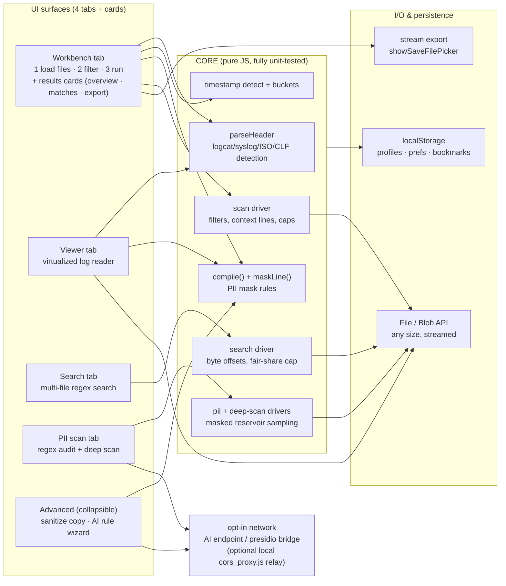
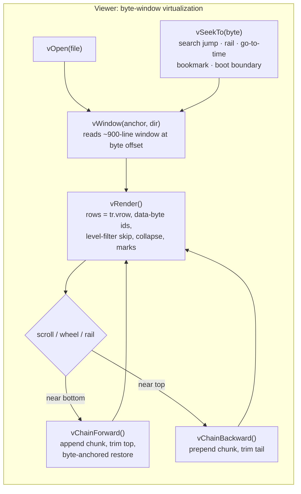
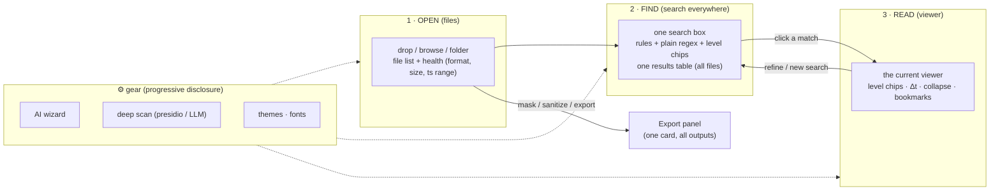
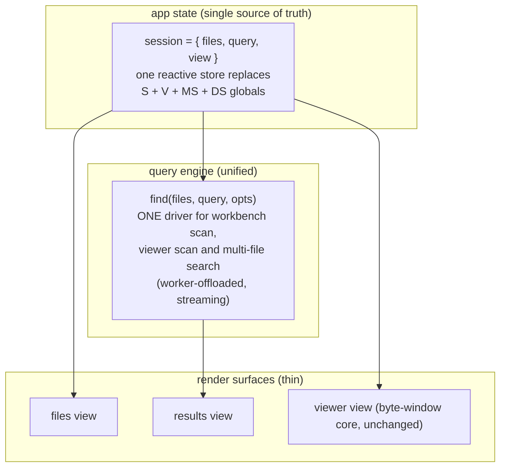
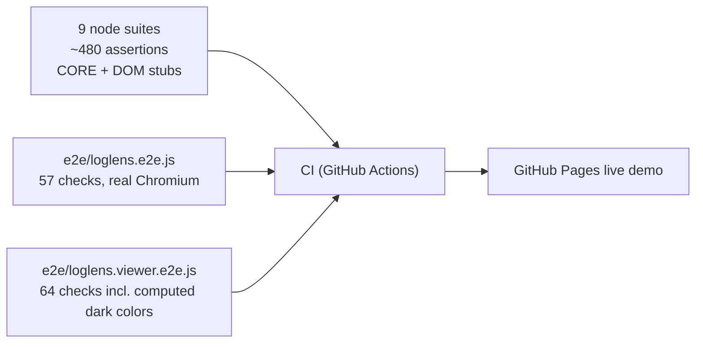

# LogLens — Architecture

Reference for the current (as-built) architecture and the **simplification redesign** proposal.
LogLens is a single HTML file (`loglens.html`): no server, no build step, no dependencies.
Everything below runs client-side; log files never leave the machine except through the two
explicitly opt-in network paths (deep scan, AI wizard).

---

## 1 · Current architecture (as-built)

### The viewer engine (the most load-bearing piece)

Key invariants (all covered by the 9 unit suites + 2 Playwright E2E files):

- every line's byte length is exact UTF-8, so paging never duplicates or skips lines
- scroll anchors are **byte identities** (`data-byte`), immune to level filtering and buffer trims
- the four window arrays (`lines/disp/hdr/blen`) always change together (`vStateSane` guard)
- hidden tab ⇒ zero geometry ⇒ chaining disabled (no background scroll drift)

---

## 2 · Redesign goal: simplicity

User-facing problem today: **four tabs + a stepper + a collapsible advanced area = too many
mental places**. The pipeline steps are clear, but the relationship between the workbench
results, the search tab, and the viewer must be learned. Two search implementations
(viewer scan vs. multi-file search) and two results tables exist for historical reasons.

### Proposed information architecture — three surfaces, one engine

### Target component structure (refactor, no behavior change to the engine)

### Simplification moves, ranked

| # | Move | Removes | Risk |
|---|------|---------|------|
| 1 | Merge **Search tab** into the workbench results (one search box above the results table; the viewer's in-view search becomes the same component scoped to the window) | 1 tab, 1 results table, 1 of the 2 scan drivers | medium — unify caps/context semantics first |
| 2 | Promote **viewer + search** to the primary flow; the workbench stepper becomes a 3-step wizard (open → find → read) shown only when no files are open | stepper bar, empty-state confusion | low |
| 3 | Fold **PII scan** into an "audit" panel of the export card (it produces mask rules — same destination) | 1 tab | low |
| 4 | One **⚙ gear menu** for AI wizard, deep scan, themes (currently scattered across advanced + toolbar) | advanced `
`, toolbar clutter | low |
| 5 | Single **export card**: extract / masked copy / stats / csv already exist — group + dedupe their options | scattered buttons | low |
| 6 | Unify persisted settings under one versioned profile object (today: ~15 localStorage keys) | key sprawl, no import/export of settings | medium — needs migration |

Non-goals: the byte-window viewer engine, the mask-rule compiler, and the streaming export
stay exactly as they are — they are the parts that make multi-GB logs work and are fully tested.

---

## 3 · Testing architecture (unchanged by the redesign)

Rule of thumb for the redesign: **every simplification move must keep the suites green** —
they encode the behavioral contract (red/green proofs live in the E2E for scrolling anchors,
level-filter jumps, and the dark theme).
